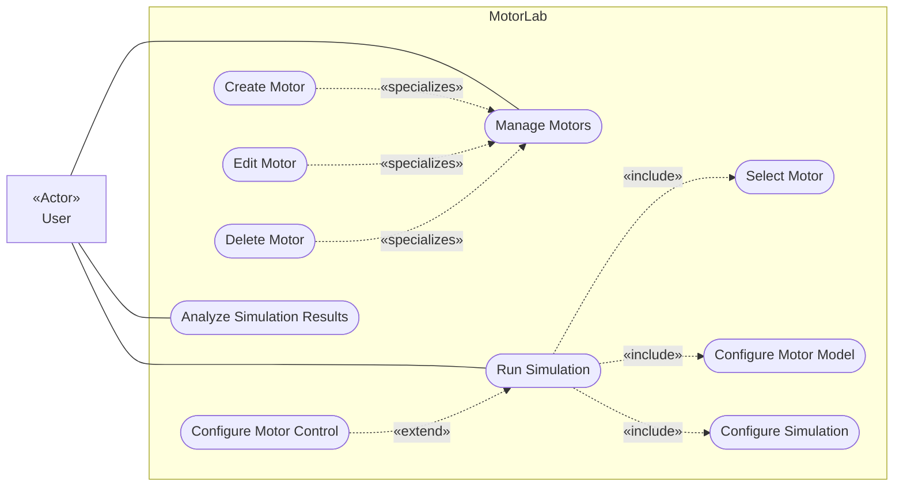
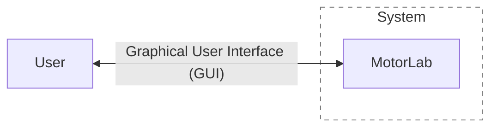

# Context and Scope

## Business Context

### Use Case Diagram

```mermaid
flowchart LR

    User["«Actor»<br>User"]

    subgraph MotorLab["MotorLab"]
        direction TB

        UC_CreateMotor([Create Motor])
        UC_EditMotor([Edit Motor])
        UC_DeleteMotor([Delete Motor])
        UC_ManageMotors([Manage Motors])
        
        UC_SelectMotor([Select Motor])
        UC_Model([Configure Motor Model])
        UC_ConfigSim([Configure Simulation])
        UC_Control([Configure Motor Control])
        UC_RunSim([Run Simulation])
        
        UC_Analyze([Analyze Simulation Results])
    end

    User --- UC_ManageMotors
    User --- UC_RunSim
    User --- UC_Analyze
    
    UC_CreateMotor -.->|«specializes»| UC_ManageMotors
    UC_EditMotor -.->|«specializes»| UC_ManageMotors
    UC_DeleteMotor -.->|«specializes»| UC_ManageMotors

    UC_RunSim -.->|«include»| UC_Model
    UC_RunSim -.->|«include»| UC_ConfigSim
    UC_RunSim -.->|«include»| UC_SelectMotor
    UC_Control -.->|«extend»| UC_RunSim

    %% Layout constraints
    User ~~~ UC_CreateMotor
    User ~~~ UC_EditMotor
    User ~~~ UC_DeleteMotor
    User ~~~ UC_Control
```

## Technical Context

```mermaid
flowchart LR
user["User"]

subgraph border["System"]
    app["MotorLab"]
end

user <-->|"Graphical User Interface (GUI)"| app
style border fill:none,stroke:#777,stroke-dasharray:5 5
```
